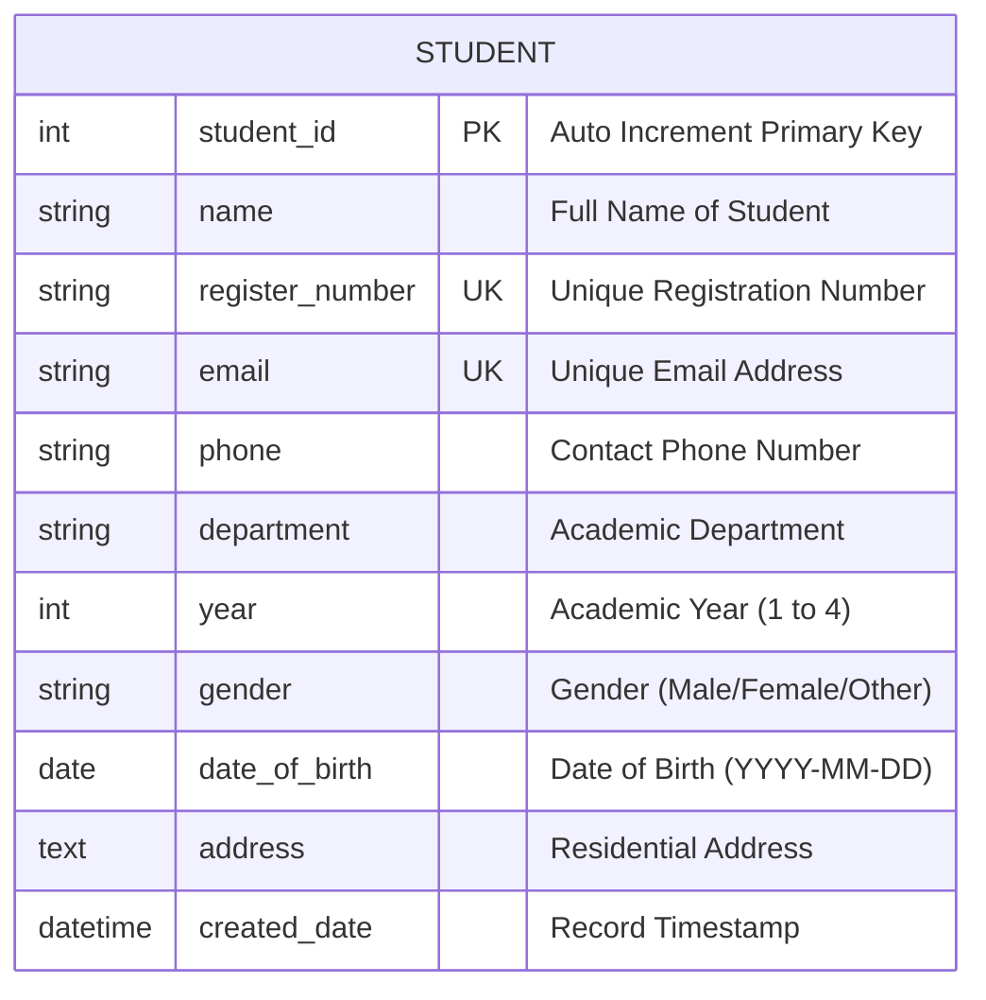

# Entity-Relationship (ER) Diagram – Student Management System

This document outlines the Entity-Relationship structure for the Student Management System relational database.

---

## 📊 1. Mermaid ER Diagram

---

## 📝 2. Database Entity Attributes & Data Types

| Attribute | Data Type | Key Type | Nullable | Default | Description |
| :--- | :--- | :--- | :--- | :--- | :--- |
| `id` / `student_id` | INTEGER | PK | NO | Auto Increment | Unique record identifier |
| `name` | VARCHAR(100) | NONE | NO | None | Student full name |
| `register_number` | VARCHAR(50) | UNIQUE | NO | None | Unique Roll/Reg number |
| `email` | VARCHAR(254) | UNIQUE | NO | None | Unique email address |
| `phone` | VARCHAR(15) | NONE | NO | None | Phone number string |
| `department` | VARCHAR(100) | NONE | NO | None | Department name |
| `year` | INTEGER | NONE | NO | 1 | Year of study (1, 2, 3, 4) |
| `gender` | VARCHAR(20) | NONE | NO | 'Male' | Gender choice |
| `date_of_birth` | DATE | NONE | NO | None | Date of Birth |
| `address` | TEXT | NONE | YES | '' | Street/City Address |
| `created_date` | DATETIME | NONE | NO | CURRENT_TIMESTAMP | Auto creation time |

---

## 🎨 3. Recreation Instructions for Draw.io

1. Open [draw.io](https://app.diagrams.net/).
2. Select **Create New Diagram** -> **Blank Diagram**.
3. In the left panel, scroll to **Entity Relation** shape library.
4. Drag an **Entity** table element onto the canvas.
5. Title the Entity: **STUDENT**.
6. Add 11 attribute rows matching the table above.
7. Mark `student_id` with `PK` icon and bold `register_number`, `email` with `UK` icon.
8. Save file as `student_management_er_diagram.drawio` or export as PNG/SVG.
